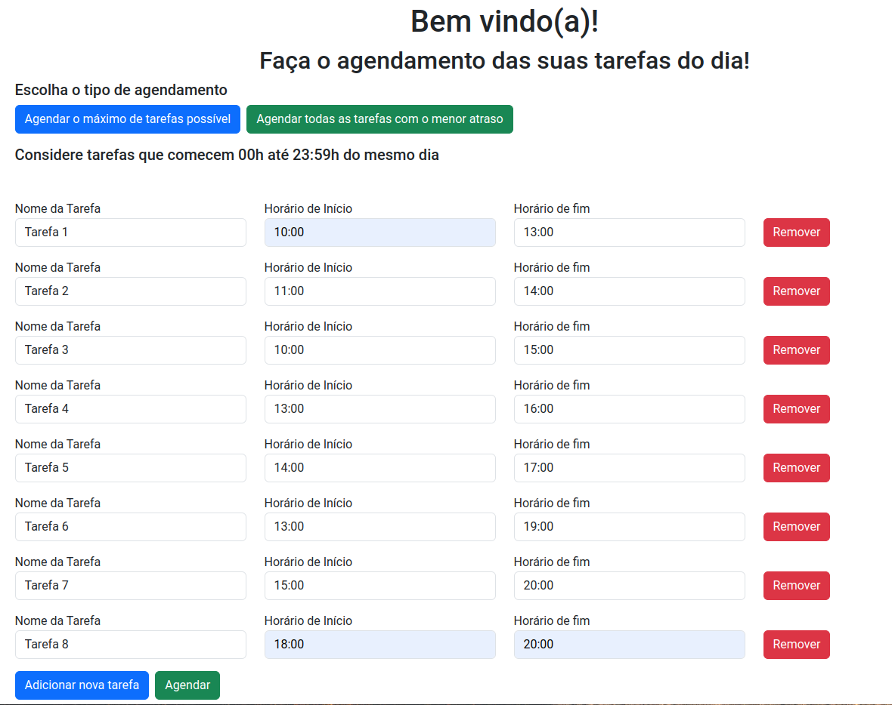
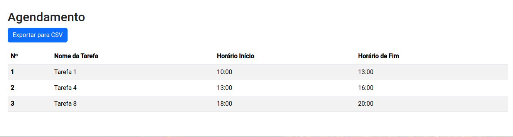
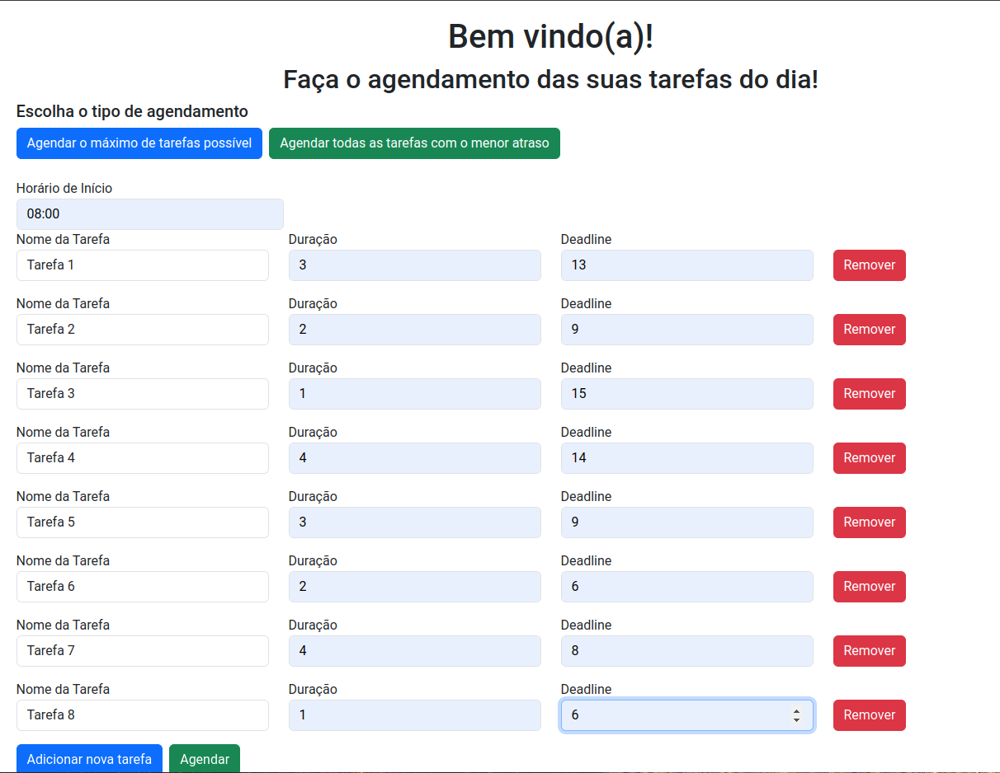
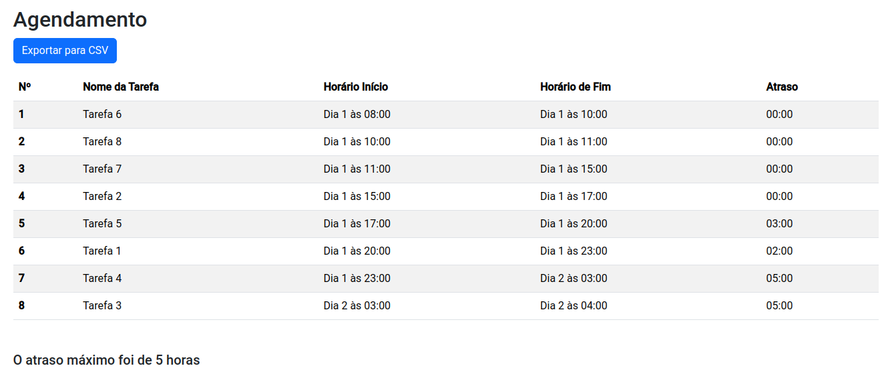

# Sistema de Agendamento

**Número da Lista**: 4 
**Conteúdo da Disciplina**: Algoritmos Ambiciosos 

## Alunos
|Matrícula | Aluno |
| -- | -- |
| 19/0046848  |  Laís Portela de Aguuiar |

## Vídeo apresentação
O vídeo de apresentação foi compartilhado no [google drive](https://drive.google.com/file/d/1AlQ7aL5asSt2VfP20iGONg4MErEVLYe6/view?usp=drive_link). Por padrão, os videos ficam em baixa qualidade no google drive, para ver na resolução original é só baixar. 

## Sobre 

A criação de um site que faz o agendamento de tarefas para o usuário terá dois tipos possíveis de agendamento:

1. Agendamento por maior número de tarefas possíveis: Usando o algoritmo de Interval Scheduling.
2. Agendamento de todas as tarefas com o menor atraso possível: Usando o algoritmo de Minimize Lateness.

Após realizar o agendamento o usuário poderá salvar as suas tarefas em um arquivo csv.

## Screenshots

## Instalação 
**Linguagem**: Typescript 
**Framework**: Angular 
Para rodar este projeto, você precisará ter as seguintes ferramentas instaladas em sua máquina:
1. Node.js (versão mais atualizada) e npm 
2. Angular CLI
    Instale globalmente utilizando o comando:
        npm install -g @angular/cli

Depois de baixar as depedências necessárias basta clonar o reposítorio, ir na pasta agendamento e executar os seguintes comandos:
1. npm install
2. ng serve

## Uso 
Após entrar no site, basta escolher o tipo de agendamento e preencher os campos necessários.

